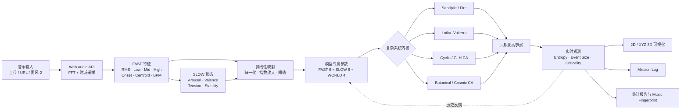

# Emergent Soundfield / 涌现声场

<p align="center">
  
</p>

一个音乐驱动的复杂系统可视化实验室。上传音乐、输入音频直链，或直接播放内置原创曲《国风-2》，观察节奏、频谱与连续情绪如何改变临界系统、传播系统、种群系统和元胞自动机的演化路径。

> 本项目用于交互艺术、复杂系统科普与娱乐性实验，不构成正式科学结论。

## 在线体验

**[打开 Emergent Soundfield](https://emergent-soundfield-lab.songxiangtang.chatgpt.site)**

## 首要界面介绍

首页是一张可实时操作的“复杂系统任务控制台”：

1. **左侧实验台**：选择七种复杂系统、2D/3D 视角、网格规模、色谱、随机种子与音乐映射强度。
2. **中央世界窗口**：观察元胞更新、BPM 边缘遥测、实时熵相空间和 NASA Mission Log 事件流。
3. **右侧遥测台**：读取音频 FAST 特征、SLOW 情绪状态、熵四象飞行轨迹和每个模型独立的世界参数。
4. **实验报告**：音乐结束后输出坍塌规模时间序列、统计检验、相图与 Music Fingerprint。

## 核心功能

- 七种复杂系统：沙堆临界、森林火灾、Lotka–Volterra、Cyclic CA、Greenberg–Hastings、土壤植物生长 CA 与宇宙物质演化 CA。
- 本地音频上传、音频直链与内置原创音乐。
- FFT 音频分析：RMS、低频、中频、高频、Onset、频谱质心和 BPM。
- FAST / SLOW 双时间尺度音乐映射，可逐项关闭。
- 64、128、256、512 或自定义 Grid。
- 2D 上帝视角与 3D 世界视角。
- 与 Grid 等高的左右节拍遥测带。
- 熵四象轨迹：将 Arousal、Valence、Tension、Stability 与 Entropy 映射为类似再入/坠落路线的历史曲线。
- NASA Mission Log 风格事件记录。
- 音乐结束后生成统计报告、时间序列、相图与 Music Fingerprint。

## 数据 Pipeline



核心思想不是把音乐直接“画成波形”，而是让音乐先改变规则参数，再由系统的历史状态、邻域关系和反馈共同决定下一步演化。

## 莫达非尼工作室

**莫达非尼工作室（Modafinil Studio）**关注科学计算、生成艺术、声音实验和交互叙事之间的交叉地带。我们希望把通常只存在于论文、公式或实验室中的复杂概念，转化为可触摸、可聆听、可反复试验的数字体验。

烧瓶中的字母 **M** 是工作室的视觉标志：烧瓶代表实验方法，轨迹与粒子代表从微观规则中涌现出的宏观秩序。Emergent Soundfield 是工作室关于“声音能否成为复杂系统外部驱动力”的持续实验。

## 科学构想

### 1. 音乐特征

对离散音频信号 \(x[n]\) 使用短时傅里叶变换：

$$
X(k,t)=\sum_{n=0}^{N-1}x[n+tH]w[n]e^{-j2\pi kn/N},
$$

其中 \(N\) 为窗口长度，\(H\) 为 hop size，\(w[n]\) 为窗函数。

短时能量采用 RMS：

$$
E(t)=\sqrt{\frac{1}{N}\sum_{n=0}^{N-1}x_t[n]^2}.
$$

频谱质心刻画频谱的“明亮程度”：

$$
C(t)=\frac{\sum_k f_k|X(k,t)|}{\sum_k|X(k,t)|}.
$$

Onset 使用正向频谱通量近似：

$$
O(t)=\sum_k\max\left(0,|X(k,t)|-|X(k,t-1)|\right).
$$

### 2. 非线性音乐映射

直接线性映射可能让安静段和高潮段之间的系统差异不明显，因此 FAST LAYER 使用归一化指数映射：

$$
M_\gamma(x)=\operatorname{clip}(x,0,1)^\gamma,\qquad \gamma>1.
$$

当前显示层主要使用 \(\gamma=1.45\)。森林火灾的部分规则使用更强的指数，例如：

$$
F_{\text{low}}=L^{1.65},\qquad
F_{\text{onset}}=O^2.
$$

这会压低弱信号，同时放大强节拍和高潮片段的系统影响。

### 3. 双时间尺度

FAST LAYER 直接响应瞬时音频特征；SLOW LAYER 使用指数平滑形成连续情绪状态：

$$
s_t=(1-\alpha)s_{t-1}+\alpha\,\hat{s}_t,
$$

其中 \(\alpha\ll1\)，因此情绪参数比节拍变化更慢。系统更新写作：

$$
z_{t+1}=F\bigl(z_t,M_{\text{fast}}(x_t),M_{\text{slow}}(x_{0:t}),\theta\bigr),
$$

其中 \(z_t\) 是复杂系统状态，\(\theta\) 是世界参数。

## 七种复杂系统

### Sandpile / 沙堆临界

每次向格点加入沙粒。当高度达到阈值 \(z_c=4\) 时：

$$
z_i\leftarrow z_i-4,\qquad
z_j\leftarrow z_j+1,\quad j\in\mathcal N_i.
$$

开放边界会让沙粒流出系统。音乐控制输入数量、落点扩散范围与临界压力，但雪崩规模由系统历史涌现。

### Forest Fire / 森林火灾

格点状态包括空地、树木、燃烧和焦土。树木被燃烧邻居点燃的概率为：

$$
P_{\text{spread}}
=P_0+aD+bL^{1.65}+cO^2,
$$

其中 \(D\) 是由紧张度与能量构成的干燥度，\(L\) 为低频，\(O\) 为 Onset。点火概率近似为：

$$
P_{\text{ignite}}
=q_0+q_1O^{1.8}+q_2D.
$$

WORLD PARAMETERS 为 Ignition、Spread、Moisture 和 Regrowth。

### Lotka–Volterra / 捕食者—猎物

使用带容量约束的归一化模型：

$$
\frac{dx}{dt}=\alpha x(1-x)-\beta xy,
$$

$$
\frac{dy}{dt}=\delta xy-\gamma y,
$$

其中 \(x\) 为猎物，\(y\) 为捕食者。音乐分别映射到猎物增长率 \(\alpha\)、捕食率 \(\beta\)、转化率 \(\delta\) 与死亡率 \(\gamma\)。

### Cyclic Cellular Automata

每个格点状态为：

$$
s_i(t)\in\{0,1,\ldots,K-1\},\qquad K=8.
$$

若 Moore 邻域中至少有 \(T\) 个格点处于下一相位，则：

$$
s_i(t+1)=\bigl(s_i(t)+1\bigr)\bmod K.
$$

否则状态保持不变。音乐通过指数映射改变捕获阈值 \(T\)，从而改变旋涡、波前与相位域的传播速度。

### Greenberg–Hastings Excitable Media

状态 \(0\) 为静息，\(1\) 为激发，\(2,\ldots,R\) 为不应期。更新规则为：

$$
s_i(t+1)=
\begin{cases}
1,&s_i(t)=0\ \land\ N_i^{(1)}\ge T,\\
s_i(t)+1,&1\le s_i(t)<R,\\
0,&s_i(t)=R,\\
0,&\text{otherwise}.
\end{cases}
$$

Onset 改变激发阈值 \(T\) 和自发激发概率，因此强节拍会生成更密集的传播波。

## 混乱度与 Music Fingerprint

对状态分布 \(p_k(t)\) 计算归一化 Shannon entropy：

$$
H(t)=
-\frac{\sum_k p_k(t)\log_2p_k(t)}
{\log_2K}.
$$

报告每秒采样一次系统状态，并在相空间中绘制：

$$
\Gamma_{\text{music}}
=\left\{\bigl(H(t),C_r(t)\bigr)\mid t=0,1,\ldots,T\right\},
$$

其中 \(C_r(t)\) 是临界度或动态压力。整条轨迹 \(\Gamma_{\text{music}}\) 就是 Music Fingerprint：在固定模型、随机种子和初态下，不同音乐会驱动系统经过不同的动力学路径。

需要注意：

$$
\Gamma_{\text{music}}
=\Gamma(\text{music},\text{model},\text{seed},\theta),
$$

因此它是“音乐—系统耦合指纹”，不是与实验条件无关的绝对音频指纹。

## 统计报告

系统比较高能量组与低能量组的平均熵：

$$
t=
\frac{\bar H_{\text{high}}-\bar H_{\text{low}}}
{\sqrt{s_{\text{high}}^2/n_{\text{high}}+
s_{\text{low}}^2/n_{\text{low}}}},
$$

并计算能量与熵的 Pearson 相关：

$$
r=
\frac{\operatorname{cov}(E,H)}
{\sigma_E\sigma_H}.
$$

浏览器中的 \(p\) 值为正态近似，仅用于探索性展示。样本较少、系统事件稀疏或音乐较短时，报告会提示统计量不稳定。

## 本地运行

环境要求：Node.js 22.13 或更高版本。

```bash
npm install
npm run dev
```

生产构建：

```bash
npm run build
```

## 项目结构

```text
app/
  page.tsx       # 模拟、音频分析、报告与界面
  globals.css    # NASA 仪器风格与响应式布局
public/
  # 可选：放置获授权的默认音频
```

## 原创音乐

在线版本内置的《国风-2》由项目作者原创。源代码开源不代表该音乐自动进入公有领域，因此公开仓库不分发 WAV 文件；音乐的复制、再分发与商业使用请先获得作者许可。

如需本地默认音乐，请将已获授权的 WAV 文件放入 `public/guofeng-2-web.wav`。即使没有该文件，上传音乐与音频直链功能仍可使用。

## License

暂未指定开源许可证。在添加 LICENSE 文件之前，代码默认保留所有权利。

